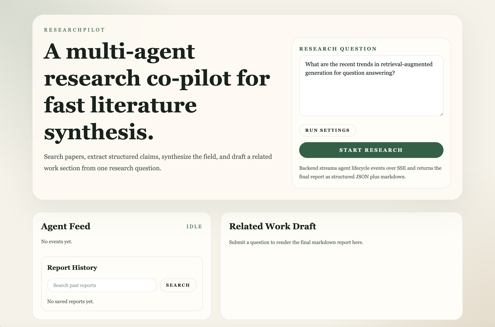
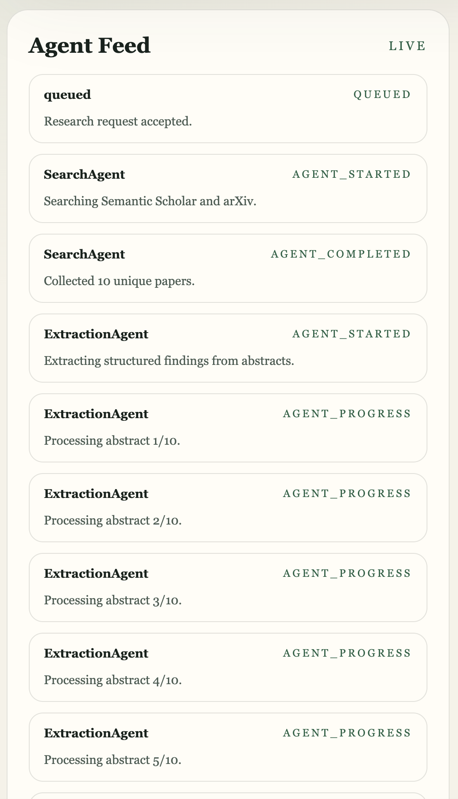
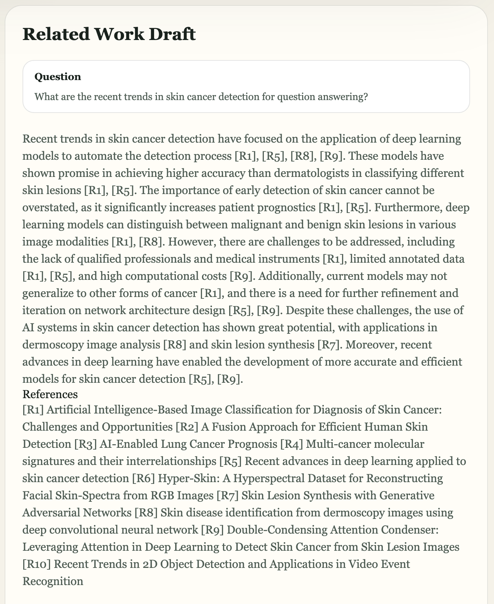
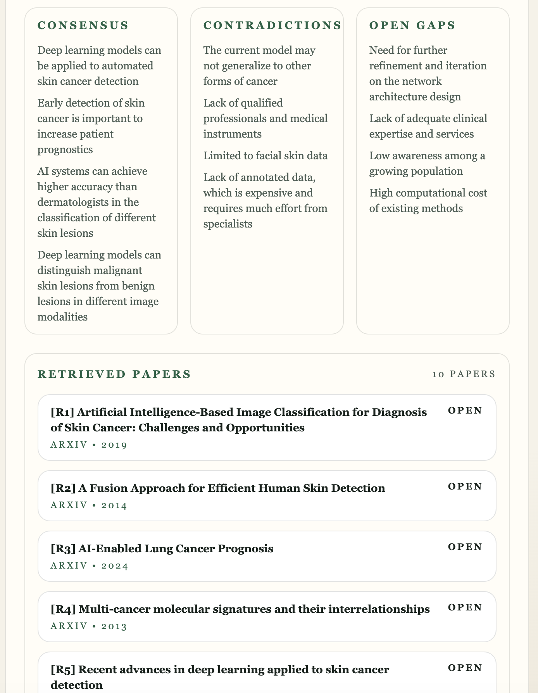

# ResearchPilot

ResearchPilot is a multi-agent research co-pilot for literature review workflows. Give it a research question and it will search papers, extract structured findings from abstracts, synthesize the field, and draft a citation-aware Related Work section.

It is designed as a portfolio-grade full-stack AI project:

- FastAPI backend with SSE streaming
- Next.js frontend with live agent status
- DSPy orchestration across four sequential agents
- Qdrant vector storage with remote-or-local embeddings
- SQLite persistence for saved reports and history search

## Screenshots

### Home



### Running



### Report





## What It Does

ResearchPilot runs this pipeline:

1. `SearchAgent` queries Semantic Scholar and arXiv, deduplicates papers, and keeps the top 10 with abstracts.
2. `ExtractionAgent` turns each abstract into structured JSON:
   `claims`, `methods`, `datasets`, `results`, `limitations`
3. `SynthesisAgent` merges those extractions into:
   `consensus`, `contradictions`, `open_gaps`
4. `WriterAgent` drafts a citation-aware markdown Related Work section with inline labels like `[R1]`.

The app also stores completed reports, supports report history, and performs semantic search over past reports.

## Demo Flow

1. Enter a research question in the frontend.
2. Watch agent-by-agent progress stream in real time over SSE.
3. Optionally override provider, model, API key, or embedding mode for the current run from the settings panel.
4. Review the final markdown report, synthesis blocks, warnings, and retrieved papers.
5. Reopen old reports from history or search prior runs semantically.

## Stack

- Backend: FastAPI, DSPy, Python 3.11+
- Frontend: Next.js App Router, React
- Vector store: Qdrant
- Persistence: SQLite
- Embeddings: provider-hosted or local Sentence Transformers fallback

## Core Features

- Citation-aware related-work generation
- Live streaming status feed during execution
- Per-run provider/model/embedding overrides from the frontend settings panel
- Semantic Scholar + arXiv retrieval with partial-failure tolerance
- Structured extraction and synthesis pipeline
- Saved report history and semantic report search
- Local embedding fallback using `BAAI/bge-small-en-v1.5`
- Docker-first setup with service healthchecks

## Architecture

```text
+------------------+        SSE        +----------------------+
| Next.js Frontend | <---------------- | FastAPI API          |
| - question input |                   | - POST /research     |
| - live status    |                   | - GET /report/{id}   |
| - history/search |                   | - GET /reports       |
| - markdown panel |                   | - GET /reports/search|
+---------+--------+                   +----------+-----------+
          |                                       |
          | question                              v
          |                             +----------------------+
          |                             | DSPy Orchestrator    |
          |                             | sequential pipeline  |
          |                             +----------+-----------+
          |                                        |
          v                                        v
   +---------------+    +-------------------+   +-------------------+   +-------------------+
   | SearchAgent   | -> | ExtractionAgent   | ->| SynthesisAgent    | ->| WriterAgent       |
   | S2 + arXiv    |    | abstract -> JSON  |   | cross-paper view  |   | related work md   |
   +---------------+    +-------------------+   +-------------------+   +-------------------+
                                                                                  |
                                                                                  v
                                                                     +------------------------+
                                                                     | SQLite + Qdrant        |
                                                                     | saved reports + search |
                                                                     +------------------------+
```

## Quickstart

### Docker Compose

```bash
cd ResearchPilot
cp backend/.env.example backend/.env
make up
```

Open:

- Frontend: [http://localhost:3000](http://localhost:3000)
- Backend docs: [http://localhost:8000/docs](http://localhost:8000/docs)

If you do not want to use `make`, `docker compose up --build` works the same way.

### Local Development

Backend:

```bash
cd ResearchPilot/backend
python3.11 -m venv .venv
source .venv/bin/activate
pip install -r requirements-dev.txt
cp .env.example .env
uvicorn app.main:app --reload
```

Frontend:

```bash
cd ResearchPilot/frontend
npm install
npm run dev
```

Qdrant:

```bash
docker run -p 6333:6333 qdrant/qdrant:v1.13.4
```

## Configuration

The backend reads `backend/.env`.

```env
LLM_PROVIDER=openai
LLM_MODEL=gpt-4.1-mini
LLM_API_KEY=your_key_here
LLM_BASE_URL=
EMBEDDING_BACKEND=auto
EMBEDDING_MODEL=
LOCAL_EMBEDDING_MODEL=BAAI/bge-small-en-v1.5
SEMANTIC_SCHOLAR_API_KEY=
QDRANT_URL=http://localhost:6333
REPORT_DB_PATH=data/researchpilot.db
CORS_ORIGINS=http://localhost:3000
```

Supported LLM provider patterns:

- OpenAI
- Anthropic / Claude
- Groq
- OpenRouter
- OpenAI-compatible base URLs

Embedding modes:

- `auto`: use remote embeddings when configured, otherwise fall back to a local model
- `remote`: require a remote embedding model
- `local`: always use the local Sentence Transformers model

Notes:

- One LLM API key is required for the agent pipeline to run.
- `SEMANTIC_SCHOLAR_API_KEY` is optional but recommended.
- arXiv does not require an API key.
- Reports persist in SQLite at `REPORT_DB_PATH`.
- OpenAI and OpenRouter get sensible embedding defaults in `auto`.

## What Users Need

For a normal local run, users need:

- Docker and Docker Compose
- one LLM provider API key
- optional Semantic Scholar API key

Users do not need:

- a hosted backend from you
- a paid embedding API
- a cloud database

This project is designed to be self-hosted locally with bring-your-own keys.

## Self-Hosting

ResearchPilot is intended to be run by users on their own machine or their own infrastructure.

Recommended modes:

1. Local laptop or workstation
   Best default for most users. Fastest setup and zero hosting cost.
2. Personal VPS with Docker
   Good if a user wants private remote access.
3. Their own cloud setup
   They can split frontend, backend, and Qdrant if they want, but that is optional.

If a user self-hosts it publicly, they should add:

- authentication
- rate limiting
- secure secret management
- correct CORS configuration
- reverse proxy support for SSE

The project does not require any OpenAI/OpenRouter/Anthropic/Groq key from you. Each user should supply their own.

## Troubleshooting

- `POST /research` fails immediately:
  Check that `LLM_PROVIDER`, `LLM_MODEL`, and `LLM_API_KEY` are set correctly in `backend/.env`.
- Qdrant errors:
  Make sure Qdrant is running on the configured `QDRANT_URL`.
- First run is slow:
  Local embedding mode may download the Sentence Transformers model the first time.
- No Semantic Scholar key:
  The app still works, but Semantic Scholar may be less reliable under rate limits.
- SSE appears stuck behind a proxy:
  Reverse proxies must allow streaming responses and avoid buffering.
- Provider/model mismatch:
  If using Groq or OpenRouter, verify the model name is valid for that provider.

## API Overview

- `POST /research`
  Starts the full pipeline and streams SSE events:
  `queued`, `agent_started`, `agent_progress`, `agent_completed`, `done`, `error`
- `GET /report/{id}`
  Returns the full saved report JSON
- `GET /reports`
  Returns recent saved report summaries
- `GET /reports/search?query=...`
  Searches prior reports semantically, with keyword fallback if vector search is unavailable

## Example Queries

- What are the recent trends in retrieval-augmented generation for question answering?
- How are diffusion models being adapted for time-series forecasting?
- What methods improve factuality in long-form LLM generation?
- What are the main limitations of graph neural networks for molecular property prediction?

## Testing

Backend:

```bash
cd ResearchPilot/backend
pytest
```

Frontend:

```bash
cd ResearchPilot/frontend
npm test
```

From the repo root:

```bash
make test
```

## Project Layout

```text
ResearchPilot/
  assets/
  backend/
    app/
      services/
    tests/
  frontend/
    app/
    tests/
  docker-compose.yml
  README.md
  LICENSE
```

## README Visuals

For stronger GitHub presentation, add screenshots or a short GIF under `assets/`, for example:

- `assets/home.png`
- `assets/running.png`
- `assets/report.png`
- `assets/demo.gif`

Then reference them near the top of this README.
